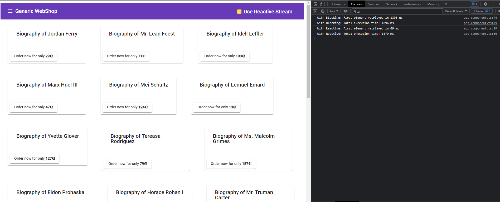

# A reactive Laboration

So I created this small project to see what the difference is to a frontend which makes a call to the backend that takes some time.

It is very much possible to have the same application run both regular blocking calls as well as reactive ones,

But for demo purposes and to have clear separation on JDBC and R2DBC, I created separate applications.

The idea is that:
1. the frontend makes a GET /products call which fetches 30 products from postgres database
2. For each product, the backend makes a GET /prices call (Bad naming and concept, I'm aware) to fetch the products price
 This call has a delay of 50 MS
3. When toggling "Reactive Streams", the data will start coming in to browser immediately, giving a smoother UX
4. When untoggling "Reactive Streams", all products and prices has to be fetched until the users sees something, which provides frustration

## How to run it

Launching demo:
1. Launch postgres: `docker run --name some-postgres -e POSTGRES_PASSWORD=mastermaster -p 5432:5432 -d postgres`
2. Start the application `backend-reactive` Which also will populate database with 30 elements if none exits
3. Start the application `backend-blocking`
4. Start the application `backend-prices`
5. Install frontend frameworks with `npm install` (Requires preinstalled node)
5. Run the frontend with `ng serve` or `npm run ng serve` (Former requires angular cli to be globally installed)
6. Go to [http://localhost:4200](http://localhost:4200) and try it out

